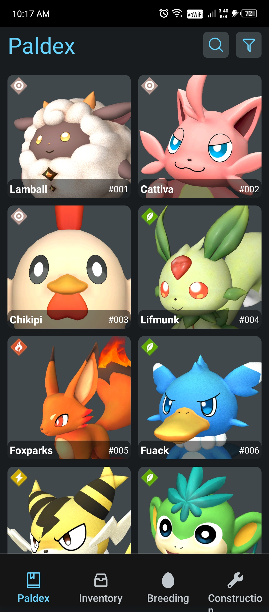
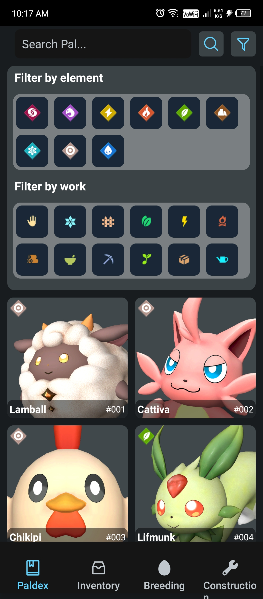
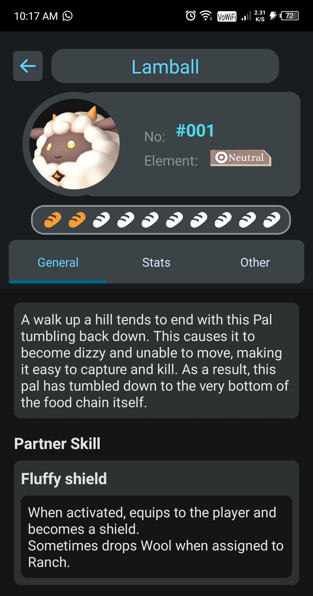
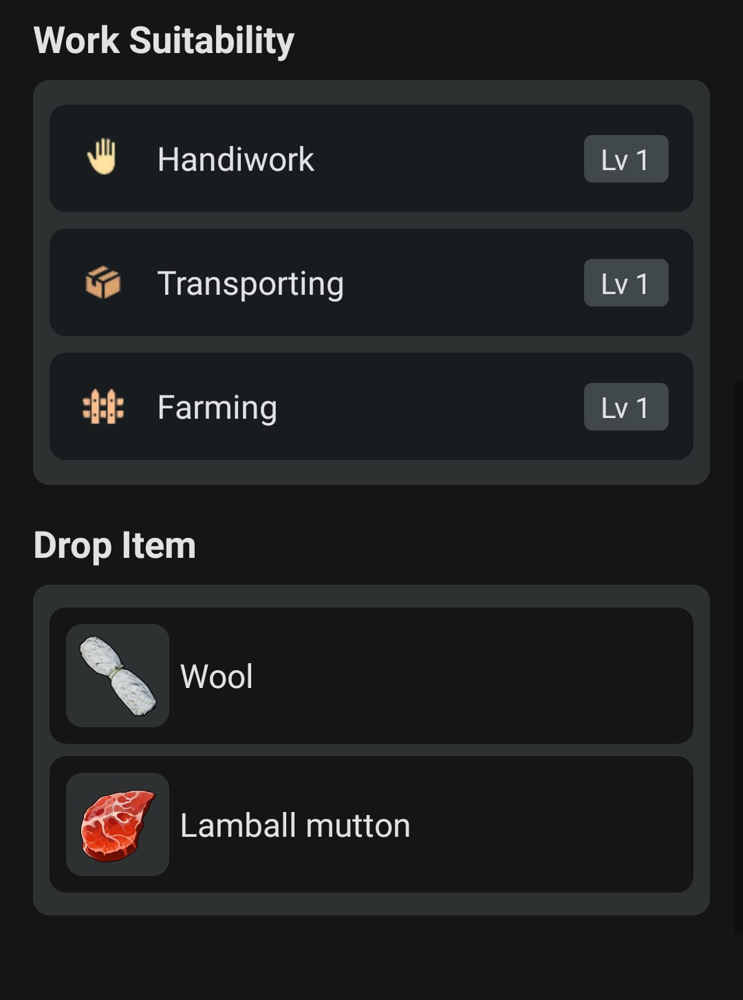

# PalDex 🐾

A comprehensive Pal database and companion app built with Expo and React Native.
## 📸 Screenshots
## 🏠 Home Screen



## 🔍 Pal Details Screen - General Tab

<br/>


Additional screenshots and images can be found in the [assets/images/appScreenshot](https://github.com/pratyanj/PalDex/tree/master/assets/images/appScreenshot) directory.

### Full app Video Demo 
<video controls>
  <source src="https://github.com/pratyanj/PalDex/raw/master/assets/images/appScreenshot/demo.mp4" type="video/mp4" width="300">
</video>

## 📱 Features

- Browse and search through Pal database
- View detailed Pal information and stats
- Track active skills and abilities
- View all inventory items and their details
- Filter pals by type, rarity, and more


## 🚀 Getting Started

### Prerequisites

- Node.js (v16 or higher)
- npm or yarn
- Expo CLI
- iOS Simulator or Android Emulator (optional)

### Installation

1. Clone the repository
   ```bash
   git clone https://github.com/pratyanj/PalDex.git
   cd PalDex
   ```

2. Install dependencies
   ```bash
   npm install
   ```

3. Start the development server
   ```bash
   npm start 
   ```

4. Open the app in:
   - [Expo Go](https://expo.dev/go) on your mobile device
   - [iOS Simulator](https://docs.expo.dev/workflow/ios-simulator/)
   - [Android Emulator](https://docs.expo.dev/workflow/android-studio-emulator/)

## 🛠️ Tech Stack

- **Framework:** Expo / React Native
- **Navigation:** Expo Router (file-based routing)
- **Language:** TypeScript/JavaScript

## 📁 Project Structure

```
PalDex/
├── app/                 # Main application code (file-based routing)
├── assets/             # Images, fonts, and other static assets
├── components/         # Reusable UI components
├── constants/          # App constants and configuration
└── hooks/             # Custom React hooks
```

## 🔧 Development

### Reset Project
When you're ready to start fresh:
```bash
npm run reset-project
```

This moves the starter code to `app-example/` and creates a blank `app/` directory.

### Available Scripts

- `npm start` - Start the Expo development server
- `npm run android` - Run on Android emulator
- `npm run ios` - Run on iOS simulator
- `npm run web` - Run in web browser

## 📋 TODO

- [ ] Add map view for pal locations
- [ ] Add loding screens
- [ ] Optimize performance
- [ ] Upadate dataset

## 🤝 Contributing

1. Fork the repository
2. Create your feature branch (`git checkout -b feature/AmazingFeature`)
3. Commit your changes (`git commit -m 'Add some AmazingFeature'`)
4. Push to the branch (`git push origin feature/AmazingFeature`)
5. Open a Pull Request


## 🙏 Acknowledgments

- [Expo](https://expo.dev) for the amazing development platform

## 📞 Contact

Pratyanj - [@pratyanj](https://github.com/pratyanj)

Project Link: [https://github.com/pratyanj/PalDex](https://github.com/pratyanj/PalDex)